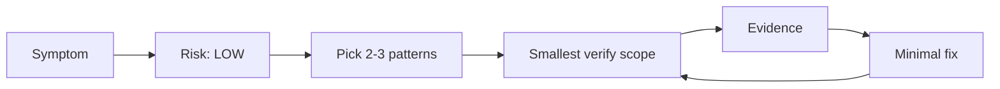
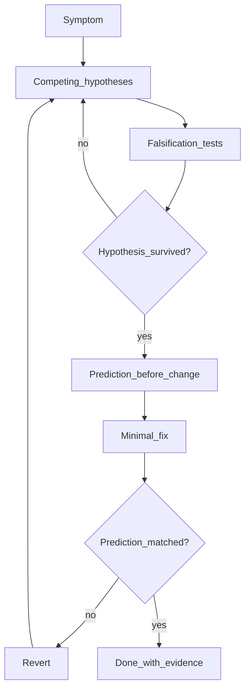

# Debugging Acceleration Playbook

_Provenance: This document originates from the AI_governance kit (https://github.com/rhemzal/AI_governance). If you copied it into another repository, keep this line to preserve traceability._

## Purpose

Practical, copy-paste-friendly flows for AI-assisted debugging and quality improvement.

This document is **advisory**. Normative enforcement remains in `constitution/` and `ci/`. Pattern definitions and trade-offs live in `usage/DEBUGGING_EFFECTIVENESS_CATALOG.md`.

## Non-goals

- Not a substitute for `constitution/AI_ENFORCEMENT.md` on high-risk changes.
- Not a license to weaken tests, skip ADRs, or bypass CI gates.
- Not a tool-specific manual — adapt commands to your repo (`DEVELOPMENT.md`, `Makefile`).

---

## Fast path — LOW-risk debugging

Use when the risk preflight is **LOW**: no boundary/contract, security, CI gate, or canonical governance doc changes.

### Preconditions

- [ ] Symptom is localized (test failure, perf regression, logging gap) — not architecture redesign.
- [ ] `constitution/AI_ENFORCEMENT_DAILY.md` mode is sufficient.
- [ ] Repo-local verification path identified (`DEVELOPMENT.md` or `make` targets).

### Checklist (copy-paste)

```text
LOW-RISK DEBUGGING CHECKLIST
1. [ ] State symptom + smallest useful scope
2. [ ] Consult usage/DEBUGGING_EFFECTIVENESS_CATALOG.md — pick top 2–3 patterns (pros/cons)
3. [ ] Use usage/DECISION_PROMPTS_DEBUGGING.md if working with an AI assistant
4. [ ] If cause unclear: run SCIENTIFIC_DEBUG_CHECKLIST (DBG-science-01) before any fix
5. [ ] Run smallest failing check (non-interactive, with timeout per AI_RULES §6.2)
6. [ ] Capture minimal evidence (usage/AI_TEST_EXECUTION_AND_DIAGNOSTICS.md)
7. [ ] AVR loop: diagnose → prediction-before-change → minimal fix → rerun smallest scope
8. [ ] If behavior changed: include ### DOC DELTA in PR
9. [ ] End with ## COMPLIANCE (daily mode)
```

### Flow



### Expected outputs

- Working diagnosis (not RCA unless verified per `architecture/TERMINOLOGY_GLOSSARY.md`).
- Commands run and rerun.
- Pattern evidence block from catalog (or `usage/DEBUGGING_PATTERN_TEMPLATE.md`).

---

## Scientific-style debugging

Use when the cause is **unclear** or the **first fix failed** — before implementing another guess.

This section implements advisory patterns `DBG-science-01`, `DBG-science-02`, and `DBG-science-03` from the catalog. Terminology: `architecture/TERMINOLOGY_GLOSSARY.md` (working hypothesis, falsification test, prediction-before-change).

### When to use vs skip

| Situation | Scientific-style? |
|-----------|-------------------|
| Clear stack trace to single line | Skip — fix directly |
| Obvious typo/syntax error | Skip |
| Reproducible symptom, unknown cause | **Use** |
| First fix merged but symptom persists | **Use** Prompt 6 |
| HIGH-risk boundary/contract change | Evidence-only until STOP gates pass |

### Checklist (copy-paste)

```text
SCIENTIFIC_DEBUG_CHECKLIST
1. [ ] State symptom + smallest useful scope
2. [ ] List 2–3 competing working hypotheses (not RCA claims)
3. [ ] Per hypothesis: cheapest falsification test (probe, log, assert, toggle) — NOT a product fix
4. [ ] Run falsification tests; record falsified vs survived
5. [ ] If none survived: generate new hypotheses (do not implement first guess)
6. [ ] Prediction-before-change: if H holds, after X we will see Y
7. [ ] Minimal fix for surviving hypothesis only
8. [ ] Verify prediction matched; if no → revert and return to step 2
9. [ ] Capture pattern evidence blocks (DBG-science-01, DBG-science-02)
```

### Flow



For copy-paste AI prompt, use **Prompt 6** in `usage/DECISION_PROMPTS_DEBUGGING.md`.

---

## High-risk path — STOP / confirm gates

Use when any **high-risk** trigger applies (`constitution/AI_ENFORCEMENT.md`):

- architecture boundaries or dependency rules
- public contracts (API, CLI, event schemas)
- CI/CD gates or canonical governance docs
- security behavior or error model
- system-of-record assumptions
- mutating MCP tools or new integration adapters

### STOP gates (do not skip)

| Gate | Action |
|------|--------|
| **G1 — Risk unknown** | Run risk preflight (`usage/HOW_TO_USE_WITH_COPILOT.md`). If HIGH or unclear → **STOP** and confirm with operator. |
| **G2 — Contract/boundary** | **STOP** for code changes until ADR considered (`adr/ADR_TEMPLATE.md`). Use DBG-contract-01 probes to gather evidence only. |
| **G3 — Error model** | **STOP** before changing failure semantics. Fault injection (DBG-resilience-01) is for tests/harness — not silent production behavior changes. |
| **G4 — MCP mutating** | **STOP** before adding/changing mutating MCP tools. Read-only diagnostics first (DBG-mcp-01). |
| **G5 — Test policy** | **STOP** before delete/weaken/quarantine without policy (`ci/TEST_GATES.md`). |

### High-risk checklist (copy-paste)

```text
HIGH-RISK DEBUGGING CHECKLIST
1. [ ] Risk preflight → HIGH documented
2. [ ] Operator confirmation for implementation (not just diagnosis)
3. [ ] Load constitution/AI_ENFORCEMENT.md
4. [ ] ADR required? yes/no — if yes, ADR before code
5. [ ] Affected files listed explicitly
6. [ ] Debugging patterns used for EVIDENCE ONLY until gates pass
7. [ ] Full ## COMPLIANCE REPORT on completion
8. [ ] ### DOC DELTA if behavior changes
```

### Evidence-only phase (allowed before confirm)

- Contract probes (DBG-contract-01)
- Record/replay capture with redaction (DBG-io-01)
- Observability slices with redaction (DBG-observe-01)
- Read-only MCP diagnostic calls (DBG-mcp-01)
- Minimal reproducible case documentation (DBG-reduce-01)

Do **not** merge product fixes that cross high-risk boundaries without compliance report and verification evidence.

---

## Long-running video / playback debugging

Dedicated flow for media, streaming, and chunked playback where wall-clock time and GPU/decoder dependencies dominate.

### Strategy

1. **Split layers** (DBG-media-01):
   - **Transport / pipeline:** segment fetch, playlist, buffer policy, seek logic — test without real decoder/GPU when possible.
   - **Decoder / render:** thin integration slice with short fixture clips; avoid full-length assets in CI.
   - **UI / session:** optional E2E smoke only after lower layers pass.

2. **Accelerate time** (DBG-media-02):
   - Inject virtual clock or fast-forward chunk delivery.
   - Document acceleration factor vs one real-time confirmation run for high-risk timing bugs.

3. **Deterministic fixtures** (DBG-io-01, DBG-snapshot-01):
   - Short looped clips, synthetic segment lists, golden manifest snapshots.
   - Store repo-locally; redact licensed or private content.

### Video playback checklist (copy-paste)

```text
LONG-RUNNING PLAYBACK DEBUG CHECKLIST
1. [ ] Identify failing layer: transport | decoder/GPU | UI
2. [ ] Transport: run accelerated/simulated input (DBG-media-02)
3. [ ] Decoder: use shortest fixture that reproduces defect
4. [ ] Capture: buffer state, segment index, seek target — not full video dump
5. [ ] Contract probe on manifest/segment API (DBG-contract-01)
6. [ ] Record/replay network trace if external CDN/API involved (redacted)
7. [ ] Add regression at lowest passing layer
8. [ ] E2E smoke only if lower layers green
```

### Common mistakes

- Running 30-minute playback in every AVR iteration.
- Mocking away backpressure, then “fixing” decoder.
- Checking in full media assets without size/license review.

---

## MCP diagnostics

Dedicated flow for Model Context Protocol (MCP) integrations used during AI-assisted troubleshooting.

### Principles

1. **MCP as integration-boundary adapter** — diagnostic tools sit at the same boundary as production MCP tools, not as unconstrained shell access.
2. **Default read-only** — list, describe, fetch metadata, health checks, sanitized samples.
3. **Mutating actions require guardrails** — explicit operator confirmation, separate tool names, audit log, idempotency where applicable.
4. **Security / data exposure** — no secrets, tokens, PII, or full production dumps in tool responses; follow `usage/SECURITY_MINIMUM_ADOPTION.md`.

### MCP diagnostic checklist (copy-paste)

```text
MCP DIAGNOSTIC SETUP CHECKLIST
1. [ ] Confirm MCP is the right boundary (not replaceable by local tests)
2. [ ] List existing MCP tools — classify read-only vs mutating
3. [ ] Add/read-only diagnostic tools only (DBG-mcp-01)
4. [ ] Scope resources narrowly (no wildcard production URIs)
5. [ ] Redact/sample outputs in docs and PR evidence
6. [ ] Mutating tool needed? → HIGH risk → STOP + confirm + ADR if interface change
7. [ ] Verification: invoke diagnostic tool, capture redacted output
8. [ ] Link error model / contract docs if failure semantics change
```

### Suggested read-only diagnostic tools (examples)

| Tool purpose | Example output |
|--------------|----------------|
| Health / version | Server version, reachable dependencies |
| Schema describe | Resource/tool input/output shape |
| Sample fetch | Single sanitized record |
| Trace correlation | Request ID list (no payloads) |

### When to avoid MCP for debugging

- Repo-local `make test` or unit tests answer the question faster.
- Diagnostic tool would duplicate unauthenticated production API access.
- Operator has not approved MCP server changes (high-risk interface change).

---

## Cross-pattern combinations

| Scenario | Suggested pattern stack |
|----------|-------------------------|
| Unclear cause | DBG-science-01 → DBG-science-03 → DBG-science-02 → fix |
| Flaky streaming test | DBG-reduce-01 → DBG-media-01 → DBG-flake-01 |
| Flaky test (unknown cause) | DBG-science-01 → DBG-flake-01 |
| Observability noise | DBG-science-01 → DBG-observe-01 (hypothesis-driven, not log archaeology) |
| External API regression | DBG-contract-01 → DBG-io-01 → DBG-snapshot-01 |
| Retry storm | DBG-observe-01 → DBG-resilience-01 → DBG-contract-01 |
| Agent cannot reproduce | DBG-reduce-01 → DBG-mcp-01 (read-only) → DBG-io-01 |
| First fix failed | DBG-science-01 → DBG-science-02 (reject prior hypothesis) |

---

## PR packaging

For behavior-changing fixes, include:

1. **DOC DELTA** (`usage/HOW_TO_USE_WITH_COPILOT.md`)
2. **Pattern evidence block(s)** from catalog
3. **TEST DIAGNOSTICS REPORT** if tests were run (`usage/AI_TEST_EXECUTION_AND_DIAGNOSTICS.md`)
4. **COMPLIANCE** or **COMPLIANCE REPORT** as appropriate

---

## Related Documents

- `usage/DEBUGGING_EFFECTIVENESS_CATALOG.md`
- `usage/DEBUGGING_PATTERN_TEMPLATE.md`
- `usage/DECISION_PROMPTS_DEBUGGING.md`
- `usage/AI_TEST_EXECUTION_AND_DIAGNOSTICS.md`
- `usage/HOW_TO_USE_WITH_COPILOT.md`
- `usage/AEP_VALIDATION.md`
- `usage/SECURITY_MINIMUM_ADOPTION.md`
- `constitution/AI_ENFORCEMENT_DAILY.md`
- `constitution/AI_ENFORCEMENT.md`
- `ci/TEST_GATES.md`
- `architecture/TERMINOLOGY_GLOSSARY.md`
- `DEVELOPMENT.md`
