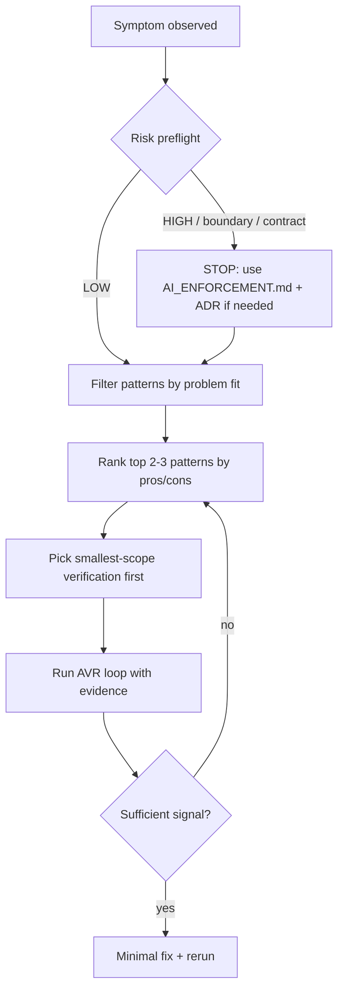

# Debugging Effectiveness Catalog

_Provenance: This document originates from the AI_governance kit (https://github.com/rhemzal/AI_governance). If you copied it into another repository, keep this line to preserve traceability._

## Purpose

Systematize **advisory** debugging and quality-improvement strategies for AI-assisted development.

Help AI assistants proactively propose suitable debugging paths with explicit trade-offs (pros/cons), fit criteria, verification steps, and PR evidence expectations.

## Non-goals

- This catalog does **not** replace normative rules in `constitution/` or CI gate definitions in `ci/`.
- This catalog does **not** mandate specific tools, frameworks, or test runners.
- This catalog does **not** authorize weakening tests, deleting failures, or bypassing high-risk enforcement.
- This catalog does **not** claim root cause analysis (RCA) without evidence — prefer **working diagnosis** during Autonomous Verification & Repair (AVR) loops.

## How to use the catalog (selection flow)



**Practical steps:**

1. Classify risk (daily vs high-risk mode per `constitution/AI_ENFORCEMENT_DAILY.md` / `constitution/AI_ENFORCEMENT.md`).
2. Describe the symptom domain (test failure, flake, performance, integration boundary, long-running media, MCP tool, etc.).
3. Scan **Problem fit** and **Use when / Do NOT use when** for each candidate pattern.
4. Compare **Pros / Cons / Implementation cost** for the top 2–3 options.
5. Use copy-paste prompts from `usage/DECISION_PROMPTS_DEBUGGING.md` when working with an AI assistant.
6. Execute the smallest useful scope; capture **PR evidence** per pattern.
7. On verification failure, apply the AVR loop (`constitution/AI_ENFORCEMENT_DAILY.md`) before escalating.

For operational playbooks and checklists, see `usage/DEBUGGING_ACCELERATION_PLAYBOOK.md`.

New patterns: use `usage/DEBUGGING_PATTERN_TEMPLATE.md`.

---

## Patterns

### Pattern 1: Layered diagnostic test pyramid (long-running media / streaming)

| Field | Value |
|-------|-------|
| **Pattern ID** | `DBG-media-01` |
| **Maturity** | `proven` |

#### Problem fit
Failures in video/audio playback, live streaming, or chunked media pipelines where full end-to-end runs are slow, GPU-dependent, or non-deterministic across environments.

#### Use when
- Symptoms appear only after minutes of real-time playback or under specific buffer states.
- Decoder, transport, and UI layers are separable.
- You need faster feedback than a full user-session replay.

#### Do NOT use when
- The defect is clearly in a single pure function with no I/O (use unit tests instead).
- Layers cannot be isolated without changing production architecture (escalate to ADR-first).
- You have no stable contracts between layers.

#### Pros
- Orders-of-magnitude faster iteration on transport/parsing vs full playback.
- Localizes failures to a layer before expensive E2E runs.
- Aligns with boundary-respecting tests (`constitution/AI_RULES.md` §4).

#### Cons
- Requires upfront fixture and contract investment.
- May miss cross-layer timing bugs if upper layers are over-mocked.
- GPU/codec paths may still need a thin integration slice.

#### Failure modes
- Over-mocking hides real backpressure or clock skew.
- “Green” unit layers while E2E still fails — indicates missing contract probes.
- Chasing decoder bugs when transport reordering is the actual fault.

#### Expected gain
- **Speed:** 5–50× faster diagnosis on non-GPU layers.
- **Quality:** clearer ownership per layer; fewer shotgun fixes.

#### Implementation cost
- **Setup:** medium — layer contracts + fixture clips/streams.
- **Maintenance:** medium — update fixtures when wire format changes.

#### PR evidence expectations
- Pyramid diagram or bullet list of which layer failed.
- Commands for each layer (unit → contract → thin integration → optional E2E).
- Minimal artifact: failing assertion, buffer state dump, or segment index.

#### Governance Alignment

| Kit area | Relevant doc(s) | Alignment note |
|----------|-----------------|----------------|
| Rules / enforcement | `constitution/AI_RULES.md`, `constitution/AI_ENFORCEMENT_DAILY.md` | Tests respect boundaries; AVR on smallest layer |
| CI / test gates | `ci/TEST_GATES.md` | Deterministic headless layers run in CI; heavy E2E optional |
| Architecture | `architecture/README.md` | Split core vs integration boundary |

#### AI Prompt Snippet
```
Apply DBG-media-01: propose a 3–4 layer diagnostic pyramid for this streaming/playback issue.
Split decoder/GPU from transport/pipeline. List pros/cons per layer test. Smallest scope first.
```

#### Evidence Block (for PR)
```text
DEBUGGING PATTERN EVIDENCE — DBG-media-01
- Pattern: Layered diagnostic test pyramid
- Failing layer:
- Layer commands run:
- Signals captured:
- Working diagnosis:
- Rerun result:
```

---

### Pattern 2: Synthetic speed-up simulation (faster-than-real-time input)

| Field | Value |
|-------|-------|
| **Pattern ID** | `DBG-media-02` |
| **Maturity** | `proven` |

#### Problem fit
Time-dependent bugs (buffer underrun, seek race, playlist advance) that require long wall-clock waits in production but can be driven with accelerated or synthetic timelines in tests.

#### Use when
- Logic depends on timestamps, segment boundaries, or paced delivery — not wall-clock UX polish alone.
- A test harness can inject frames/chunks faster than real time.
- You need to reach failure conditions in seconds instead of minutes.

#### Do NOT use when
- Bug is strictly real-time scheduling or OS/GPU vsync dependent.
- Acceleration changes ordering guarantees the production path relies on.
- No injectable clock or transport abstraction exists (consider ADR for testability).

#### Pros
- Dramatically shortens debug cycles for pacing and buffer logic.
- Enables property-style checks over many virtual timelines.
- Pairs well with DBG-media-01 (transport layer).

#### Cons
- Risk of false confidence if accelerated path diverges from production pacing.
- Requires explicit virtual clock or throttle bypass in test mode.
- May need separate “real-time smoke” for final validation.

#### Failure modes
- Tests pass at 100× speed but fail at 1× (missing real-time constraint).
- Hidden coupling to `sleep()` instead of clock injection.
- Flaky tests when acceleration races internal thread pools.

#### Expected gain
- **Speed:** 10–100× for buffer/seek/playlist defects.
- **Quality:** broader scenario coverage in CI time budget.

#### Implementation cost
- **Setup:** medium — virtual clock or fast-forward API.
- **Maintenance:** low–medium — keep acceleration flag out of production defaults.

#### PR evidence expectations
- Document acceleration factor and clock injection mechanism.
- Show failing scenario time vs equivalent real-time duration.
- One real-time or near-real-time confirmation run when risk is high.

#### Governance Alignment

| Kit area | Relevant doc(s) | Alignment note |
|----------|-----------------|----------------|
| Rules / enforcement | `constitution/AI_RULES.md` §6.2 | Non-interactive commands; timeouts on long runs |
| Test execution | `usage/AI_TEST_EXECUTION_AND_DIAGNOSTICS.md` | Avoid manual sleeps; prefer framework waits |
| CI / test gates | `ci/TEST_GATES.md` | Accelerated tests must remain deterministic |

#### AI Prompt Snippet
```
Apply DBG-media-02: design a faster-than-real-time simulation for this time-dependent bug.
State assumptions about clock/pacing. List risks of acceleration vs production.
```

#### Evidence Block (for PR)
```text
DEBUGGING PATTERN EVIDENCE — DBG-media-02
- Acceleration factor:
- Virtual clock / injection point:
- Scenario duration (simulated vs real-time equivalent):
- Working diagnosis:
- Real-time confirmation (if run):
```

---

### Pattern 3: Record/replay harness

| Field | Value |
|-------|-------|
| **Pattern ID** | `DBG-io-01` |
| **Maturity** | `proven` |

#### Problem fit
Intermittent or environment-specific failures at integration boundaries (HTTP, WebSocket, gRPC, file I/O) where live reproduction is costly or non-deterministic.

#### Use when
- A failing run can be captured once and replayed deterministically.
- External services are unstable or rate-limited.
- You need shareable evidence across developers and CI.

#### Do NOT use when
- Recorded traffic contains secrets or PII (redact first or use synthetic fixtures).
- Protocol is stateful in ways the recorder does not capture (partial sessions).
- Replay diverges due to time/nonce/auth — needs contract stubs instead.

#### Pros
- Stable reproduction across machines.
- Fast CI feedback without live dependencies.
- Excellent PR evidence (attach trace file).

#### Cons
- Fixture drift when API evolves.
- Large artifacts if not trimmed.
- Can hide “works only with this exact traffic” bugs.

#### Failure modes
- Stale cassettes mask regressions.
- Recording production data into the repo (security/compliance violation).
- Replay passes while live system fails (missing dynamic auth or clock).

#### Expected gain
- **Speed:** eliminates wait on external instability.
- **Quality:** reproducible bug reports and regression tests.

#### Implementation cost
- **Setup:** medium — recorder + storage convention (repo-local `.artifacts/` or fixtures).
- **Maintenance:** medium — refresh cassettes on contract change.

#### PR evidence expectations
- Path to replay fixture (redacted).
- Command that replays and fails before fix / passes after.
- Note on fixture scope (single request vs full session).

#### Governance Alignment

| Kit area | Relevant doc(s) | Alignment note |
|----------|-----------------|----------------|
| Rules | `constitution/AI_RULES.md` §4 | Integration boundary tests |
| Security | `usage/SECURITY_MINIMUM_ADOPTION.md` | No secrets in fixtures |
| Copilot usage | `usage/HOW_TO_USE_WITH_COPILOT.md` | Repo-local artifact paths |

#### AI Prompt Snippet
```
Apply DBG-io-01: propose record/replay for this boundary failure. Require redaction plan and replay command.
```

#### Evidence Block (for PR)
```text
DEBUGGING PATTERN EVIDENCE — DBG-io-01
- Fixture path (redacted):
- Record command:
- Replay command:
- First failure signal on replay:
```

---

### Pattern 4: Deterministic fault injection (timeouts / reorder / partial failure)

| Field | Value |
|-------|-------|
| **Pattern ID** | `DBG-resilience-01` |
| **Maturity** | `proven` |

#### Problem fit
Resilience bugs: hung requests, duplicate delivery, partial writes, retry storms, and ordering violations that rarely occur in happy-path tests.

#### Use when
- System has retries, circuit breakers, or idempotency requirements.
- You can inject faults at a boundary without mutating production code paths permanently.
- You need to verify error model behavior (`constitution/AI_ENFORCEMENT.md` when error model changes).

#### Do NOT use when
- Fault injection requires changing security behavior without review (high-risk).
- Production environment would be used for injection (use test harness only).
- Faults are not observable — no metrics/logs/assertions to verify response.

#### Pros
- Makes rare failures routine and testable.
- Validates error handling and recovery paths.
- Supports table-driven scenarios (timeout 0ms, 1ms, hang, 50% drop).

#### Cons
- Harness complexity.
- Risk of testing implementation details instead of contracts.
- Over-injection can lead to unrealistic failure combinations.

#### Failure modes
- Tests pass with injection but production failure mode differs.
- Injection point too low — misses real network behavior.
- Masking product bugs by loosening timeouts without justification.

#### Expected gain
- **Speed:** faster than waiting for natural failures.
- **Quality:** higher confidence in retry/idempotency contracts.

#### Implementation cost
- **Setup:** medium–high — fault shim at boundary.
- **Maintenance:** medium — update with protocol changes.

#### PR evidence expectations
- Matrix of injected faults vs expected outcomes.
- Logs/metrics showing detection and recovery.
- Explicit note if error model or public contract changed (ADR trigger).

#### Governance Alignment

| Kit area | Relevant doc(s) | Alignment note |
|----------|-----------------|----------------|
| High-risk | `constitution/AI_ENFORCEMENT.md` | Error model / contract changes |
| CI | `ci/TEST_GATES.md`, `ci/INTERFACE_GATES.md` | Contract tests for failure semantics |
| Terminology | `architecture/TERMINOLOGY_GLOSSARY.md` | RCA vs working diagnosis |

#### AI Prompt Snippet
```
Apply DBG-resilience-01: list deterministic faults to inject (timeout, reorder, partial failure).
Map each to expected behavior. Flag high-risk error-model changes.
```

#### Evidence Block (for PR)
```text
DEBUGGING PATTERN EVIDENCE — DBG-resilience-01
- Fault matrix:
- Injection point:
- Observed vs expected:
- Error model / ADR required: yes/no
```

---

### Pattern 5: MCP diagnostic adapter pattern (boundary-safe introspection)

| Field | Value |
|-------|-------|
| **Pattern ID** | `DBG-mcp-01` |
| **Maturity** | `experimental` |

#### Problem fit
Debugging through Model Context Protocol (MCP) integrations where direct production introspection is unsafe, opaque, or crosses trust boundaries.

#### Use when
- MCP exposes an integration boundary (tools, resources, external systems).
- Read-only diagnostics can narrow failure domain without mutating state.
- Agents need structured introspection instead of ad-hoc shell access.

#### Do NOT use when
- MCP tool would expose secrets, PII, or unredacted production data.
- Mutating actions are required without explicit operator confirmation.
- Native repo-local commands suffice (prefer `DEVELOPMENT.md` / make targets first).

#### Pros
- Keeps diagnostics at declared integration boundary.
- Enables AI assistants to gather evidence within guardrails.
- Separates read-only diagnostic tools from write operations.

#### Cons
- MCP surface must be designed and maintained.
- Wrongly scoped tools increase attack surface.
- Extra indirection vs direct test harness.

#### Failure modes
- Diagnostic tool accidentally performs mutating side effects.
- Over-broad resource URIs leak data.
- Agents rely on MCP when unit tests would be faster.

#### Expected gain
- **Speed:** faster evidence gathering for integration issues.
- **Quality:** repeatable, boundary-aligned introspection.

#### Implementation cost
- **Setup:** medium — read-only MCP tools + auth scoping.
- **Maintenance:** medium — version with API changes.

#### PR evidence expectations
- List of diagnostic MCP tools (read-only default).
- Sample tool invocation output (redacted).
- Mutating-action guardrail statement.

#### Governance Alignment

| Kit area | Relevant doc(s) | Alignment note |
|----------|-----------------|----------------|
| Terminology | `architecture/TERMINOLOGY_GLOSSARY.md` | MCP definition |
| Security | `usage/SECURITY_MINIMUM_ADOPTION.md` | Data exposure cautions |
| Architecture | `architecture/README.md` | Adapter at integration boundary |
| High-risk | `constitution/AI_ENFORCEMENT.md` | Interface / security behavior changes |

#### AI Prompt Snippet
```
Apply DBG-mcp-01: propose read-only MCP diagnostic tools for this integration.
Separate mutating actions. List data exposure risks and verification steps.
```

#### Evidence Block (for PR)
```text
DEBUGGING PATTERN EVIDENCE — DBG-mcp-01
- Diagnostic tools (read-only):
- Sample output (redacted):
- Mutating tools (if any) + guardrails:
- Verification:
```

---

### Pattern 6: Contract-first boundary probes

| Field | Value |
|-------|-------|
| **Pattern ID** | `DBG-contract-01` |
| **Maturity** | `standard` |

#### Problem fit
Failures at integration boundaries where teams debate whether the bug is “ours” or “theirs” — HTTP schemas, event payloads, CLI output, adapter interfaces.

#### Use when
- A machine-readable contract exists or should exist (OpenAPI, JSON Schema, protobuf).
- You can fail fast on schema/status semantics before deep E2E.
- Boundary change is suspected (check high-risk triggers).

#### Do NOT use when
- No stable contract — define ADR + contract first.
- Probe duplicates an existing comprehensive test without narrowing scope.
- Contract checks are swapped for behavioral tests entirely.

#### Pros
- Fast, deterministic signal at the boundary.
- Clear PR evidence (schema diff, validation error).
- Prevents architecture drift (`ci/ARCHITECTURE_GATES.md`).

#### Cons
- Schema maintenance overhead.
- May pass contract but fail user-visible behavior.
- False precision if schemas are too loose.

#### Failure modes
- Chasing adapter code when contract was wrong.
- Weakening schema to greenwash tests.
- Missing versioning strategy for evolving contracts.

#### Expected gain
- **Speed:** minutes to isolate boundary mismatch.
- **Quality:** enforces explicit integration contracts.

#### Implementation cost
- **Setup:** low–medium — schema + probe test.
- **Maintenance:** medium — version with API evolution.

#### PR evidence expectations
- Failing validation message or contract diff.
- Probe command and smallest payload that fails.
- ADR link if contract semantics changed.

#### Governance Alignment

| Kit area | Relevant doc(s) | Alignment note |
|----------|-----------------|----------------|
| Rules | `constitution/AI_RULES.md` §4 | Integration boundary tests |
| CI | `ci/INTERFACE_GATES.md`, `ci/ARCHITECTURE_GATES.md` | Contract gates |
| High-risk | `constitution/AI_ENFORCEMENT.md` | Public contract changes |

#### AI Prompt Snippet
```
Apply DBG-contract-01: define the smallest contract probe for this boundary failure.
Include schema/status checks before E2E.
```

#### Evidence Block (for PR)
```text
DEBUGGING PATTERN EVIDENCE — DBG-contract-01
- Contract artifact:
- Probe command:
- Validation failure:
- Boundary owner (us/them/integration):
```

---

### Pattern 7: Golden / snapshot checks (stable machine-readable behavior)

| Field | Value |
|-------|-------|
| **Pattern ID** | `DBG-snapshot-01` |
| **Maturity** | `proven` |

#### Problem fit
Regressions in stable, machine-readable outputs: CLI JSON, serialized configs, API response shapes, DOM accessibility trees, rendered markdown AST.

#### Use when
- Output format is intentionally stable and versioned.
- Human review of diffs is easier than hand-written assertions for large structures.
- Behavior is deterministic in CI.

#### Do NOT use when
- Output includes timestamps, random IDs, or environment-specific paths without normalization.
- Snapshot replaces semantic assertions for critical business rules.
- AI proposes vague snapshots to hide failures (`usage/AI_TEST_EXECUTION_AND_DIAGNOSTICS.md`).

#### Pros
- High signal for unintended output drift.
- Fast to add once harness exists.
- Excellent PR diff evidence.

#### Cons
- Snapshot churn on cosmetic changes.
- Review fatigue if snapshots are huge.
- Can encode bugs if updated blindly.

#### Failure modes
- Bulk snapshot update without understanding diffs.
- Non-deterministic snapshots → false flakes.
- Testing implementation details instead of user-visible contracts.

#### Expected gain
- **Speed:** quick regression detection on next change.
- **Quality:** prevents silent format breakage.

#### Implementation cost
- **Setup:** low–medium — normalizer + snapshot path.
- **Maintenance:** medium — disciplined update workflow.

#### PR evidence expectations
- Snapshot diff with intentional change called out.
- Normalization rules documented.
- Link to contract/version policy if output is public.

#### Governance Alignment

| Kit area | Relevant doc(s) | Alignment note |
|----------|-----------------|----------------|
| Test diagnostics | `usage/AI_TEST_EXECUTION_AND_DIAGNOSTICS.md` | Do not weaken assertions |
| CI | `ci/INTERFACE_GATES.md` | DOM/a11y snapshot mentions |
| Interface | `interface/INTERFACE_RULES_PROPOSAL.md` | Stable automation-first output |

#### AI Prompt Snippet
```
Apply DBG-snapshot-01: propose golden/snapshot checks with normalization rules.
Warn if output is non-deterministic. Prefer semantic asserts for business rules.
```

#### Evidence Block (for PR)
```text
DEBUGGING PATTERN EVIDENCE — DBG-snapshot-01
- Snapshot path:
- Normalization applied:
- Diff summary:
- Intentional vs accidental drift:
```

---

### Pattern 8: Flakiness triage and quarantine loop

| Field | Value |
|-------|-------|
| **Pattern ID** | `DBG-flake-01` |
| **Maturity** | `standard` |

#### Problem fit
Non-reproducible test failures, order-dependent tests, timing-sensitive UI tests, and CI noise that blocks progress.

#### Use when
- Failure is intermittent or environment-correlated.
- Same commit passes on rerun without code changes.
- Flakiness budget policy applies (`ci/TEST_GATES.md`).

#### Do NOT use when
- Failure is deterministic (use AVR on product/test code).
- Quarantine would hide a real regression without tracking.
- Default response is delete or weaken the test.

#### Pros
- Restores CI trust while root cause is investigated.
- Forces explicit flake tracking and ownership.
- Aligns with progressive CI maturity levels.

#### Cons
- Quarantined tests reduce coverage until fixed.
- Teams may leave tests quarantined indefinitely.
- Triage overhead.

#### Failure modes
- Misclassifying deterministic bug as flake.
- Permanent quarantine without ticket/policy.
- Retry loops that mask systemic timing bugs.

#### Expected gain
- **Speed:** unblocks merge path while investigating.
- **Quality:** long-term suite determinism when loop is closed.

#### Implementation cost
- **Setup:** low — quarantine tag + tracking convention.
- **Maintenance:** ongoing triage cadence.

#### PR evidence expectations
- Flake classification rationale (evidence from multiple runs).
- Quarantine marker or issue link.
- Plan: fix, stabilize environment, or remove quarantine.

#### Governance Alignment

| Kit area | Relevant doc(s) | Alignment note |
|----------|-----------------|----------------|
| CI | `ci/TEST_GATES.md` | Quarantine over delete; flake windows |
| Test diagnostics | `usage/AI_TEST_EXECUTION_AND_DIAGNOSTICS.md` | Flaky vs deterministic |
| Daily enforcement | `constitution/AI_ENFORCEMENT_DAILY.md` | Do not hide failures |

#### AI Prompt Snippet
```
Apply DBG-flake-01: triage this intermittent failure. Evidence from multiple runs.
Recommend fix vs quarantine per ci/TEST_GATES.md. Do not delete or weaken without justification.
```

#### Evidence Block (for PR)
```text
DEBUGGING PATTERN EVIDENCE — DBG-flake-01
- Classification: flake | deterministic | environment
- Repro rate:
- Runs observed:
- Quarantine action:
- Fix plan:
```

---

### Pattern 9: Minimal reproducible scenario reduction

| Field | Value |
|-------|-------|
| **Pattern ID** | `DBG-reduce-01` |
| **Maturity** | `standard` |

#### Problem fit
Complex failures with large reproduction steps (multi-service, long scripts, full app navigation) where cause is unknown.

#### Use when
- A failure exists but scope is too large for efficient AVR loops.
- You need a shareable minimal case for reviewers or AI assistants.
- Bisection or delta debugging is next step.

#### Do NOT use when
- Smallest scope is already known (run it immediately).
- Reduction removes the conditions that trigger the bug.
- Spending reduction time exceeds fixing obvious signal.

#### Pros
- Faster diagnosis and review.
- Smaller tests added as regression guards.
- Better AI assistant prompts (less noise).

#### Cons
- Time upfront before fixing.
- Risk of oversimplification missing interaction bugs.
- May require multiple reduction iterations.

#### Failure modes
- “Minimal” case still depends on hidden global state.
- Reduced case passes while full scenario fails (incomplete reduction).
- Endless reduction without hypothesis.

#### Expected gain
- **Speed:** shorter AVR cycles after reduction.
- **Quality:** durable regression test from minimal case.

#### Implementation cost
- **Setup:** low — systematic halving/bisection discipline.
- **Maintenance:** low — minimal case becomes permanent test.

#### PR evidence expectations
- Before/after reproduction steps.
- Minimal command or test case added.
- List of removed irrelevant factors.

#### Governance Alignment

| Kit area | Relevant doc(s) | Alignment note |
|----------|-----------------|----------------|
| Daily enforcement | `constitution/AI_ENFORCEMENT_DAILY.md` | Smallest useful scope |
| Test diagnostics | `usage/AI_TEST_EXECUTION_AND_DIAGNOSTICS.md` | Evidence before repair |
| AEP | `usage/AEP_VALIDATION.md` | Multi-file fixes after reduction |

#### AI Prompt Snippet
```
Apply DBG-reduce-01: reduce this failure to the smallest reproducible scenario.
Document each removed factor. Output minimal command/test.
```

#### Evidence Block (for PR)
```text
DEBUGGING PATTERN EVIDENCE — DBG-reduce-01
- Original repro:
- Minimal repro:
- Removed factors:
- Minimal test added: yes/no
```

---

### Pattern 10: Observability-first debugging pack (logs / metrics / traces)

| Field | Value |
|-------|-------|
| **Pattern ID** | `DBG-observe-01` |
| **Maturity** | `proven` |

#### Problem fit
Production-like or integrated failures where symptom is clear but internal path is opaque — latency spikes, silent drops, partial errors, distributed traces.

#### Use when
- Structured logs, metrics, or traces exist or can be added at low risk.
- Failure is not easily reachable via unit test alone.
- You need correlation IDs across components.

#### Do NOT use when
- Logging would expose secrets without redaction.
- High-cardinality metrics would be added without review in production.
- Observability becomes substitute for deterministic tests.

#### Pros
- Reveals actual runtime path vs assumed path.
- Supports post-incident evidence.
- Narrows which layer/pattern to apply next.

#### Cons
- Noise without filtering discipline.
- Setup cost for tracing across services.
- Risk of PII/secrets in logs.

#### Failure modes
- Log archaeology without hypothesis (slow).
- Missing correlation → inconclusive traces.
- Over-instrumentation in hot paths.

#### Expected gain
- **Speed:** faster localization when signals are good.
- **Quality:** evidence-backed working diagnosis.

#### Implementation cost
- **Setup:** low–high depending on existing stack.
- **Maintenance:** medium — dashboards/alerts optional.

#### PR evidence expectations
- Log/trace slice with correlation ID.
- Metric or span that pinpoints failure segment.
- Redaction confirmation for sensitive fields.

#### Governance Alignment

| Kit area | Relevant doc(s) | Alignment note |
|----------|-----------------|----------------|
| Test diagnostics | `usage/AI_TEST_EXECUTION_AND_DIAGNOSTICS.md` | Prefer live detection; minimal evidence |
| Security | `usage/SECURITY_MINIMUM_ADOPTION.md` | No secrets in logs |
| Rules | `constitution/AI_RULES.md` §6.2 | Non-interactive collection where possible |

#### AI Prompt Snippet
```
Apply DBG-observe-01: list logs/metrics/traces to enable for this failure.
Propose correlation strategy. Redact secrets. Smallest signal before full log dump.
```

#### Evidence Block (for PR)
```text
DEBUGGING PATTERN EVIDENCE — DBG-observe-01
- Signals enabled:
- Correlation ID:
- Key log/trace slice (redacted):
- Working diagnosis:
```

---

## Pattern index (quick reference)

| ID | Pattern | Primary gain |
|----|---------|--------------|
| `DBG-media-01` | Layered diagnostic test pyramid | Layer isolation for streaming/media |
| `DBG-media-02` | Synthetic speed-up simulation | Fast time-dependent iteration |
| `DBG-io-01` | Record/replay harness | Deterministic boundary reproduction |
| `DBG-resilience-01` | Deterministic fault injection | Resilience / error-path coverage |
| `DBG-mcp-01` | MCP diagnostic adapter | Boundary-safe agent introspection |
| `DBG-contract-01` | Contract-first boundary probes | Fast schema/contract failures |
| `DBG-snapshot-01` | Golden/snapshot checks | Stable output regression guard |
| `DBG-flake-01` | Flakiness triage & quarantine | CI trust during flake investigation |
| `DBG-reduce-01` | Minimal reproducible reduction | Smaller AVR scope |
| `DBG-observe-01` | Observability-first pack | Runtime path evidence |

---

## Related Documents

- `usage/DEBUGGING_PATTERN_TEMPLATE.md`
- `usage/DEBUGGING_ACCELERATION_PLAYBOOK.md`
- `usage/DECISION_PROMPTS_DEBUGGING.md`
- `usage/AI_TEST_EXECUTION_AND_DIAGNOSTICS.md`
- `usage/AI_RUN_EVIDENCE.md`
- `usage/AEP_VALIDATION.md`
- `constitution/AI_RULES.md`
- `constitution/AI_ENFORCEMENT_DAILY.md`
- `constitution/AI_ENFORCEMENT.md`
- `ci/TEST_GATES.md`
- `ci/INTERFACE_GATES.md`
- `architecture/TERMINOLOGY_GLOSSARY.md`
- `README.md`
