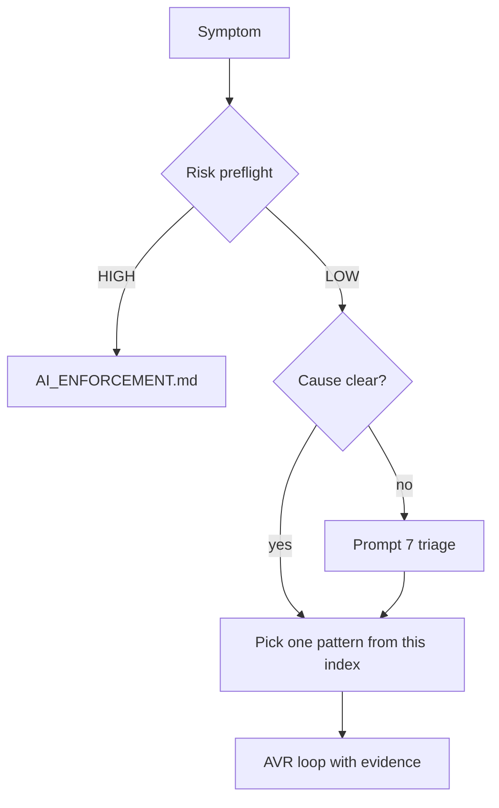

# Debugging Index (Curated Entry)

_Provenance: This document originates from the AI_governance kit (https://github.com/rhemzal/AI_governance). If you copied it into another repository, keep this line to preserve traceability._

**Start here** for debugging guidance — not the full [Debugging Effectiveness Catalog](DEBUGGING_EFFECTIVENESS_CATALOG.md) (1400+ lines).

## When to use this index

1. **HIGH-risk** (boundaries, contracts, security): stop — use `constitution/AI_ENFORCEMENT.md` and ADR if needed.
2. **Cause unclear or first fix failed:** run [Prompt 7](DECISION_PROMPTS_DEBUGGING.md) (max **3** pattern IDs).
3. **Cause proven or domain obvious:** pick **one** pattern below, then [Prompt 6](DECISION_PROMPTS_DEBUGGING.md) if using the scientific path.

## Top patterns by domain

| ID | One-line fit | Catalog section |
| --- | --- | --- |
| `DBG-science-01` | Competing hypotheses; falsify before fixing | Scientific method triage |
| `DBG-science-02` | State prediction before change; catch false-green fixes | Scientific method triage |
| `DBG-flake-01` | Intermittent CI failure; quarantine and bisect | Flakiness |
| `DBG-reduce-01` | Shrink repro to smallest failing case | Minimal reproduction |
| `DBG-contract-01` | Schema/API mismatch at boundary | Contract probes |
| `DBG-io-01` | Non-deterministic external IO at boundary | Record/replay |
| `DBG-snapshot-01` | Output drift vs known-good baseline | Golden/snapshot |
| `DBG-observe-01` | Need runtime path evidence (logs, traces) | Observability-first |
| `DBG-resilience-01` | Error path or fault handling untested | Fault injection |
| `DBG-media-01` | Layer isolation for streaming/media | Long-running media |
| `DBG-media-02` | Speed up time-dependent playback tests | Long-running media |
| `DBG-mcp-01` | Debug via MCP tool boundary safely | MCP diagnostics |
| `DBG-science-05` | One experiment discriminates multiple hypotheses | Scientific method triage |
| `DBG-science-07` | Verify test harness before chasing product bug | Scientific method triage |

Full pattern entries, pros/cons, and evidence templates: `usage/DEBUGGING_EFFECTIVENESS_CATALOG.md`.

Operational checklists: `usage/DEBUGGING_ACCELERATION_PLAYBOOK.md`.

## Related Documents

- `usage/DEBUGGING_EFFECTIVENESS_CATALOG.md`
- `usage/DECISION_PROMPTS_DEBUGGING.md`
- `usage/DEBUGGING_ACCELERATION_PLAYBOOK.md`
- `usage/AI_TEST_EXECUTION_AND_DIAGNOSTICS.md`
- `constitution/AI_ENFORCEMENT_DAILY.md`
